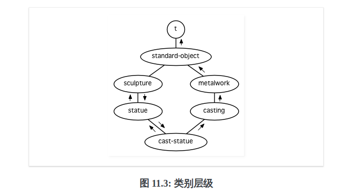

- [第十一章-Common Lisp对象系统](#sec-1)
  - [面向对象编程](#sec-1-1)
  - [类与实例](#sec-1-2)
  - [槽的属性](#sec-1-3)
  - [基类](#sec-1-4)
  - [优先级](#sec-1-5)
  - [通用函数](#sec-1-6)
  - [辅助方法](#sec-1-7)
  - [方法组合机制](#sec-1-8)
  - [封装](#sec-1-9)
  - [两种模型](#sec-1-10)
  - [总结](#sec-1-11)

# 第十一章-Common Lisp对象系统<a id="sec-1"></a>

## 面向对象编程<a id="sec-1-1"></a>

使用结构体计算二维图形的面积

```common-lisp
(defstruct rectangle
  height width)

;; 圆形
(defstruct circle
  radius)

;; 面积
(defun area (x)
  (cond ((rectangle-p x)
         (* (rectangle-width x) (rectangle-height x)))
        ((circle-p x)
         (* pi (expt (circle-radius x) 2)))))

(let ((r (make-rectangle)))
  (setf (rectangle-height r) 2
        (rectangle-width r) 3)
  (area r))
```

使用 CLOS(Common Lisp Object System) 写出的等效程序。

```common-lisp
;; CLOS二维图形的面积
(defclass rectangle ()
  (height width))

(defclass circle ()
  (radius))

(defmethod area ((x rectangle))
  (* (slot-value x 'height) (slot-value x 'width)))

(defmethod area ((x circle))
  (* pi (expt (slot-value x 'raidus) 2)))

(let ((r (make-instance 'rectangle)))
  (setf (slot-value r 'height) 2
        (slot-value r 'width) 3)
  (area r))
```

面向对象暗指继承，槽和方法皆有集成。

`defclass` 宏第二个参数列出了所有基类。

```common-lisp
;; 色彩类
(defclass colored ()
  (color))

(defclass colored-circle (circle colored)
  ())

```

`color-circle` 的实例会有两个槽，从 `circle` 类继承而来的 `radius` 和 `colored` 类继承而来的 `color` 。 `color-circle` 会继承 `area` 方法。

## 类与实例<a id="sec-1-2"></a>

`make-instance` 函数创建类的实例。

```common-lisp
(setf c (make-instance 'circle))
```

`slot-value` 函数可以给实例槽赋值。

```common-lisp
(setf (slot-value c 'radius) 1)
```

## 槽的属性<a id="sec-1-3"></a>

传递给 `defclass` 的第三个参数必须是一个槽定义的列表。

一般情况下，一个槽定义可以是一个列表，第一个是槽的名称，伴随着一个或多个属性。属性像关键字那样指定。

通过替一个槽定义一个访问器( `:accessor` 属性)，我们可以隐式地定义了一个可以引用到槽的函数，使我们不需要再调用 `slot-value` 函数。

```common-lisp
(defclass circle ()
  ((radius :accessor circle-radius)
   (center :accessor circle-center)))
;; 使用槽的访问器
(setf c (make-instance 'circle))
(setf (circle-radius c) 1)
(circle-radius c)
```

`:writer` 和 `:reader` 属性可以获得访问器的写入或读取行为。

`:initform` 属性可以指定一个槽的缺省值。

`:initarg` 属性可以指定 `make-instance` 调用期间就初始化槽。

```common-lisp
(defclass circle ()
  ((radius :accessor circle-radius
           :initarg :radius
           :initform 1)
   (center :accessor circle-center
           :initarg :center
           :initform (cons 0 0))))
```

`:initarg` 的优先级比 `:initform` 要高。

创建 `circle` 实例时，我们使用关键字参数 `initarg` 给槽赋值，或者将槽设置为 `initform` 所指定的缺省值。

```common-lisp
(setf c (make-instance 'circle :radius 3))
```

`:allocation` 属性和 `:class` 属性可以声明某些槽是共享的。

```common-lisp
(defclass tabloid ()
  ((top-story :accessor tabloid-story
              :allocation :class)))
(setf daily-blab (make-instance 'tabloid)
      unsolicited-mail (make-instance 'tabloid))

(setf (tabloid-story daily-blab) 'adultery-of-senator)
(tabloid-story unsolicited-mail)
```

`:documentation` 属性，用来作为 `slot` 的文档字符串。

`:type` 保证一个槽里只会有这种类型的元素。

## 基类<a id="sec-1-4"></a>

`defclass` 第二个参数是一个列出其基类的列表

```common-lisp
(defclass graphic ()
  ((color :accessor graphic-color :initarg :color)
   (visible :accessor graphic-visible :initarg :visible
            :initform t)))

(defclass screen-circle (circle graphic) ())

(graphic-color (make-instance 'screen-circle
                              :color 'red :radius 3))
```

基类的槽可以的缺省值可以被子类槽的缺省值所覆盖。

```common-lisp
(defclass screen-circle (circle graphic)
  ((color :initform 'purple)))

(graphic-color (make-instance 'screen-circle))
```

## 优先级<a id="sec-1-5"></a>

一个类可以有多个基类，该类如有同名的槽或方法，需要优先级排序。

```common-lisp
(defclass sculpture () (height width depth))

(defclass statue (sculpture) (subject))

(defclass metalwork () (metal-type))

(defclass casting (metalwork) ())

(defclass cast-statue (statue casting) ())
```

 一个类的优先级列表可以通过如下步骤，遍历应用的网络计算出来

-   从网络的底部开始。
-   往上走，遇到未探索的分之永远选最左边。
-   如果你将进入一个节点，你发现此节点右边也有一条路同样进入该节点时，该节点退后，重走刚刚的老路，回到第一个节点，这个节点上有尚未探索的路径。接着返回步骤2。
-   当你抵达表示 `t` 的节点时，遍历就结束了。你第一次进入每个节点的顺序就决定了节点在优先级列表的顺序。
-   上图演示了网络遍历的方式，优先级为
    -   `cast-statue`
    -   `statue`
    -   `sculpture`
    -   `casting`
    -   `metalwork`
    -   `standard-object`
    -   `t`

## 通用函数<a id="sec-1-6"></a>

通用函数是由一个或多个方法组成的一个函数。方法可以用 `defmethod` 来定义 。

```common-lisp
(defmethod combine (x y)
  (list x y))
```

定义一些新的方法引用的类

```common-lisp
(defclass stuff () ((name :accessor name :initarg :name)))

(defclass ice-cream (stuff) ())

(defclass topping (stuff) ())
```

一个方法的特化指出它是应用至何种类别的参数。

替 `combine` 定义的第二个方法，参数被特化了，每个出现在列表里的参数都有一个类名。方法仅能在传给 `combine` 的参数分别是 `ice-cream` 与 `topping` 的实例时。

```common-lisp
(defmethod combine ((ic ice-cream) (top topping))
  (format nil "~A ice-scream with ~A topping."
          (name ic)
          (name top)))
```

Lisp会使用参数的类别与参数的特化匹配且优先级最高的方法。

```common-lisp
(combine (make-instance 'ice-cream :name 'fig)
         (make-instance 'topping :name 'treacle))
```

使用其他参数时候，会得到第一次定义的方法。

```common-lisp
(combine 23 'skiddoo)
;; 调用如下方法
(defmethod combine (x y)
  (list x y))
```

一个方法中，任何参数的组合都可以特化。

```common-lisp
(defmethod combine ((ic ice-cream) x)
  (format nil "~A ice-cream with ~A."
          (name ic)
          x))

;; 调用两个对象参数的方法
(combine (make-instance 'ice-cream :name 'grape)
         (make-instance 'topping :name 'marshmallow))

;; 调用一个对象参数的方法
(combine (make-instance 'ice-cream :name 'clam)
         'reluctance)
```

当一个通用方法被调用时，参数决定了一个或多个可用的方法。如果调用中的参数在参数特化的约定内，我们说一个方法是可用的。

如果多于一个可用方法，最具体的会被调用。最具体可用的方法是由调用传入参数所属类别的优先级所决定的。由左到右审视参数。

上例中，一个 `ice-cream` 的实例是，按顺序来 `ice-cream` ， `stuff` ， `standard-object` ，以及 `t` 类别的成员。

方法不需要在由 `defclass` 定义的类别层级来特化，他们也可以替类型做特化(反映除类型的类别)。

对数字做特化的 `combine`

```common-lisp
(defmethod conbine ((x number) (y number))
  (+ x y))
```

对单一对象(实例)做特化。

```common-lisp
(defmethod combine ((x (eql 'powder)) (y (eql 'spark)))
  'boom)
```

方法可以像Common Lisp函数一样复杂的参数列表，但所有组成通用函数方法的参数列表必须是一致的。参数的数量必须一致，同样数量的选择性参数，要么一起使用 `&rest` 或者 `&key` 参数，或者一起不要用。

只有必要参数可以被特化，所以每个方法都可以通过名字及必要参数的特化独一无二地识别出来。

如果我们定义另一个方法，有着同样的修饰符及特化，它会覆写掉原先的。

```common-lisp
(defmethod combine ((x (eql 'power)) (y (eql 'spark)))
  'kaboom)
```

## 辅助方法<a id="sec-1-7"></a>

方法可以通过 `:before` ， `:after` 以及 `:around` 等辅助方法来增强。

`:before` 与 `:after` 方法允许我们将新的行为包在调用主方法的周围。

`:around` 方法存在的话，会调用的是 `:around` 方法而不是主方法。

`:around` 方法自己可能会调用主方法。通过函数 `call-next-method` 。

标准方法组合机制里面，调用一个通用函数会调用

-   最具体的 `:around` 方法，如果有的话。
-   否则，依序
    -   所有的 `:before` 方法，从最具体到最不具体。
    -   最具体的主方法。
    -   所有的 `:after` 方法，从最不具体到最具体。

辅助方法通过 `defmethod` 调用中，在方法名后加上一个修饰关键字来定义。

```common-lisp
(defclass speaker () ())

(defmethod speak ((s speaker) string)
  (format t "~A" string))

(speak (make-instance 'speaker)
       "I'm hungry")

(defclass intellectual (speaker) ())

(defmethod speak :before ((i intellectual) string)
  (princ "Perhaps "))

(defmethod speak :after ((i intellectual) string)
  (princ " in some sense"))

(speak (make-instance 'intellectual)
       "I am hungry")

(defmethod speak :before ((s speaker) string)
  (princ "I think "))

(speak (make-instance 'intellectual) "I am hungry")
```

`:around` 方法如果有一个替传入通用函数特别定义的 `:around` 方法，则优先调用 `:around` 方法，一个 `:around` 或主方法，可以通过调用 `call-next-method` 来调用下一个方法。

在调用下一个方法前，它使用 `next-method-p` 来检查是否有下个方法可调用。

```common-lisp
(defmethod speak :around ((c courtier) string)
  (format t "Does the King believe that ~A?" string)
  (if (eql (read) 'yes)
      (if (next-method-p) (call-next-method))
      (format t "Indeed, it is a preposterous idea. ~%"))
  'bow)

(speak (make-instance 'courtier) "kings will last")
```

## 方法组合机制<a id="sec-1-8"></a>

在标准方法组合中，只有最具体的主方法被调用，但是想把所有可用的主方法的结果汇总起来。

```common-lisp
(defun price (&rest args)
  (+ (apply <most specific primary method> args)
     .
     .
     .
     (apply <least specific primary method> args)))
```

我们可以指定一个通用函数的方法组合所要使用的类型，借由在 `defgeneric` 里调用加入一个 `method-combination` 子句。

```common-lisp
(defgeneric price (x)
  (:method-combination +))
```

`price` 方法会使用 `+` 方法组合。任何替 `price` 定义的 `defmethod` 必须有 `+` 来作为第二个参数。

```common-lisp
(defclass jacket () ())
(defclass trousers () ())
(defclass suit (jacket trousers) ())

(defmethod price + ((jk jacket)) 350)
(defmethod price + ((tr trousers)) 200)
(price (make-instance 'suit))
```

下列符号可以用来作为 `defmethod` 的第二个参数或者是作为 `defgeneric` 调用中， `method-combination` 的选项。

```common-lisp
+
and
append
list
max
min
nconc
or
progn
```

可以使用 `standard` ，yields标准方法组合。

一旦指定了通用函数要用何种方法组合，所有替该函数定义的方法必须用同样的机制。

如果使用 `:before` 或 `:after` 作为 组合方法的第二个参数，会抛出一个错误。

如果想改变方法的组合机制，需要通过调用 `fmakunbound` 来移除整个通用函数。

```common-lisp
(fmakunbound 'price)
```

## 封装<a id="sec-1-9"></a>

Common Lisp里，包是标准的手段来区分公开及私有的信息。要限制某个东西的存取，我们将它放在另一个包里，并针对外部介面，仅输出需要用的名字。

我们可以通过输出可被改动的名字，来封装一个槽，但不是槽的名字。

以下定义下，包外部的代码只能创造 `counter` 实例，并调用 `increment` 及 `clear` 方法，但不能够存取 `state` 。

```common-lisp
(defpackage "CTR"
  (:use "COMMON-LISP")
  (:export "COUNTER" "INCREMENT" "CLEAR"))
(in-package ctr)

(defclass counter ()
  ((state :initform 0)))

(defmethod increment ((c counter))
  (incf (slot-value c 'state)))

(defmethod clear ((c counter))
  (setf (slot-value c 'state) 0))
```

如果想进一步区别类的内部及外部介面，并使其不可能存取一个槽所存的值，可以这样做。将所有需要引用它的代码定义完，将槽的名字 `unintern`

这样没有任何合法的、其他的办法，从任何包来引用到这个槽。

```common-lisp
(unintern 'state)
```

## 两种模型<a id="sec-1-10"></a>

面向对象的两种实现方式

-   消息传递模型：一开始先有消息传递。
-   通用函数模型：广义的消息传递。

消息传递模型中，方法属于对象，且方法的继承与槽的继承概念一样。要找到一个物体的面积，我们传递给它一个 `area` 消息

这调用了任何对象 `obj` 所拥有或继承来的 `area` 方法。

```common-lisp
tell obj area
```

想传入额外的参数。如一个 `move` 方法接受一个说明要移动多远的参数。如果我们想要告诉 `obj` 移动10个单位，我们可以传下面的信息

```common-lisp
(move obj 10)
```

在消息传递模型里面，我们仅特化第一个参数。牵扯到多对象时，没有规则告诉方法该如何处理。

在消息传递模型里面，方法是对象所有的。在通用函数里，方法是特别为对象打造的，可以特化多个参数。

消息传递模型是通用函数模型的子集。

## 总结<a id="sec-1-11"></a>

-   在面向对象编程中，函数 f 通过定义拥有 f 方法的对象来隐式地定义。对象从它们的父母继承方法。
-   定义一个类别就像是定义一个结构，但更加啰嗦。一个共享的槽属于一整个类别。
-   一个类别从基类中继承槽。
-   一个类别的祖先被排序成一个优先级列表。理解优先级算法最好的方式就是通过视觉。
-   一个通用函数由一个给定名称的所有方法所组成。一个方法通过名称及特化参数来识别。参数的优先级决定了当调用一个通用函数时会使用哪个方法。
-   方法可以通过辅助方法来增强。标准方法组合机制意味着如果有 :around 方法的话就调用它；否则依序调用 :before ，最具体的主方法以及 :after 方法。
-   在操作符方法组合机制中，所有的主方法都被视为某个操作符的参数。
-   封装可以通过包来实现。
-   面向对象编程有两个模型。通用函数模型是广义的消息传递模型。
