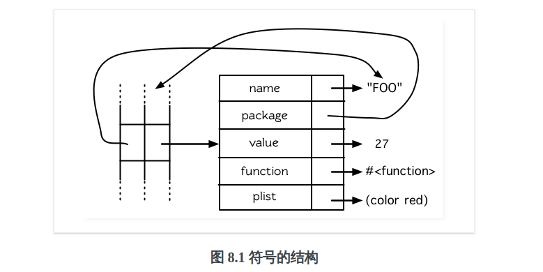

- [第八章-符号](#sec-1)
  - [符号名](#sec-1-1)
  - [属性列表](#sec-1-2)
  - [符号很不简单](#sec-1-3)
  - [创建符号](#sec-1-4)
  - [多重包](#sec-1-5)
  - [关键字](#sec-1-6)
  - [符号与变量](#sec-1-7)
  - [示例：随机文本](#sec-1-8)
  - [总结](#sec-1-9)

# 第八章-符号<a id="sec-1"></a>

## 符号名<a id="sec-1-1"></a>

符号是变量的名字，符号本身以对象所存在。 符号可以用任何字符串当作名字，可以通过调用 `symbol-name` 来获得符号的名字。

```common-lisp
(symbol-name 'abc)
```

在缺省情况下，Common Lisp在读入时，会把符号名字所有英文字母都转换为大写。

Common Lisp缺省是部分大小写的

```common-lisp
(eql 'abc 'Abc)
(CaR '(a b c))
```

一个名字包含空白，或其他可能被读取器认为是重要的字符的符号，要用特殊的语法来引用。任何存在垂直杠之间的字符序列将被视为符号。

基本上任何不是数字，或不包含读取器视为重要字符的符号不需要 `|` 来参照。下面的最后一个元素就是不需要使用 `|` 来参照。

```common-lisp
(list '|Lisp 1.5| '|| '|abc| '|ABC|)
;; 打印
(|Lisp 1.5| || |abc| ABC)
```

当 `|` 这种符号被读入时，不会有大小写转换，而宏字符与其他的字符被视为一般字符。

`|` 是一种表示符号的特殊语法，他们不是符号的名字之一。

## 属性列表<a id="sec-1-2"></a>

Common Lisp里，每个符号都有一个属性列表或称为 `plist` 。

函数 `get` 接受符号及任何类型的键值，然后返回在符号属性列表中，与键关联的值。

```common-lisp
(get 'alizarin 'color)
```

`get` 使用 `eql` 来比较各个键。若某个特定属性没找到时， `get` 返回 `nil` 。

将键与值关联起来，可以使用 `setf` 及 `get` 。

```common-lisp
(setf (get 'alizarin 'color) 'red)
(get 'alizarin 'color)

(setf (get 'alizarin 'transparency) 'high)
(symbol-plist 'alizarin)
```

`symbol-plist` 可以打印符号的属性列表。

## 符号很不简单<a id="sec-1-3"></a>

符号可以有名字、主包、作为变量的值、作为函数的至以及带有一个属性列表。

符号是实际的对象，不仅是名字。当两个变量设成相同的符号时，与两个变量的指针都指向同样的对象。

## 创建符号<a id="sec-1-4"></a>

包是将名字映射到符号的符号表，每个普通的符号都属于一个特定的包，称符号被包扣押了(intern)了。

函数与变量用符号作名称。包借由限制哪个符号可以访问来实现模块化(modularity)。

大多数符号在读取时就被扣押了，第一次输入一个新符号的名字时，Lisp会产生一个新的符号对象，并将它扣押到当下的包里(缺省是 `common-lisp-user` 包)

`intern` 函数接受字符串与选择性包参数，来扣押一个名称为字符串名的符号。 选择性包参数缺省是当前的包。 如果在当前包存在该符号，则返回当前包里的一个符号。如果符号尚未存在，会创建一个这样的符号出来。第二个返回值告诉我们符号是否存在。

```common-lisp
(intern "RANDOM-SYMBOL")
NIL
(intern "RANDOM-SYMBOL")
:INTERNAL
```

不是所有的符号都会被扣押，有时候一个自由的符号是有用的。自由的符号叫做 `gensyms` 。

## 多重包<a id="sec-1-5"></a>

`defpackage` 定义一个新包叫做 `my-application`

-   它使用( `:use` )了其他两个包， `common-lisp` 与 `my-utilities` ，可以不需要用包修饰符来存取这些包所导出的符号。
-   `my-application` 包恩深输出三个符号 `WIN` 、 `LOSE` 以及 `DRAW` 。
-   `defpackage` 给了 `my-application` 一个匿称 `app` ，别的包可以这样引用到这些符号，比如 `app:win`
-   

`defpackage` 伴随着一个 `in-package` ，确保当前包是 `my-application` 所有其他未修饰的符号会被扣押至 `my-application` ，除非之后有别的 `in-package` 出现。

当一个文件被载入时，当前的包总是被重置成载入之前的值。

```common-lisp
(defpackage "MY-APPLICATION"
  (:use "COMMON-LISP" "MY-UTILITIES")
  (:nicknames "APP")
  (:export "WIN" "LOSE" "DRAW"))
(in-package my-application)
```

## 关键字<a id="sec-1-6"></a>

在 `keyword` 包的符号有两个独特的性质

-   总是对自己求值
-   可以在任何地方引用它们。如 `:x` 而不是 `keyword:x` 。

关键字以 `:` 为字首，是关键字的识别符。

## 符号与变量<a id="sec-1-7"></a>

符号与变量的从两个非常不同的层面互相关联。

当符号是特别变量的名字时，变量的值存在符号的 `value` 栏位。

`symbol-value` 函数引用到符号的 `value` 栏位，所以在符号和特殊变量之间，有直接的连接关系。

(静态作用域的变量)词法变量的符号只不过是个占位符，编译器会将其转换为一个寄存器或内存位置的引用位址。我们无法追踪到这个符号，除非在debug的某个地方。

符号与词法变量之间的值是没有连接的，只要一有值，符号就消失了。



## 示例：随机文本<a id="sec-1-8"></a>

## 总结<a id="sec-1-9"></a>

符号的名字可以是任何字符串，但由 `read` 创建的符号缺省值会被转换为大写。 符号带有相关联的属性列表，虽然他们不需要是相同的形式，但行为像是 `assoc-lists` 。 符号是实质的对象，比较像结构，而不是名字。 包将字符串映射至符号。要在包里给符号创建一个条目的方法就是扣留它。符号不需要被扣留。 包通过限制可以引用的名字增加模块化。缺省的包会是 `user` 包，但为了提高模块化，大的程序通常分成数个包。 可以让符号在别的包被存取。关键字是自身求值并在所有的包里都可以存取。 当一个程序用来操作单词时，用符号来表示单词是很方便的。
