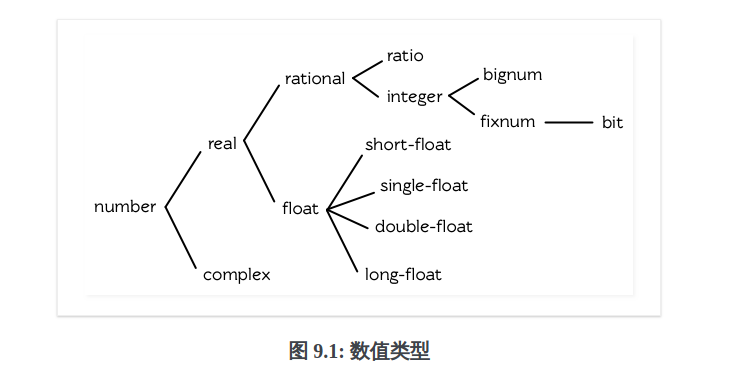

- [第九章-数字](#sec-1)
  - [类型](#sec-1-1)
  - [转换及取出](#sec-1-2)
  - [比较](#sec-1-3)
  - [算术](#sec-1-4)
  - [指数](#sec-1-5)
  - [三角函数](#sec-1-6)
  - [表示法](#sec-1-7)
  - [光线追踪](#sec-1-8)

# 第九章-数字<a id="sec-1"></a>

## 类型<a id="sec-1-1"></a>

Common Lisp数值类型的层级 

决定计算过程返回何种数字，通用的经验法则如下

-   如果数值函数接受一个或多个浮点数作为参数，则返回值会是浮点数(或由浮点数组成的复数)。
-   可约分的壁纸会转换为最简分数。
-   若计算过程中复数的虚部变成0，则复数会被转成实数。

## 转换及取出<a id="sec-1-2"></a>

函数 `float` 将任何实数转换为浮点数。

```common-lisp
(mapcar #'float '(1 2/3 .5))
```

函数 `truncate` 返回任何实数的整数部分。第二个返回值是小数部分。

```common-lisp
(truncate 1.3)
```

函数 `floor` 和 `ceiling` 以及 `round` 从他们的参数中导出整数。

函数 `floor` 返回小于等于其参数的最大整数。第二个返回值为小数部分。

函数 `ceiling` 返回大于等于其参数的最小整数。第二个返回值为小数部分。

函数 `round` 返回最接近其参数的整数(四舍五入)。第二个返回值为小数部分。

函数 `signum` 返回 `1、0或-1` ，取决它的参数是正数、零或负数。

函数 `abs` 返回其参数的绝对值。

回文函数

```common-lisp
(defun palindrome? (x)
  (let ((mid (/ (length x) 2)))
    (equal (subseq x 0 (floor mid))
           (reverse (subseq x (ceiling mid))))))
```

`truncate` 定义

```common-lisp
(defun our-truncate (n)
  (if (> n 0)
      (floor n)
      (ceiling n)))
```

## 比较<a id="sec-1-3"></a>

比较数字的符号有 `=、<、<=、>、>=、/=(不相等)` ，接受一个或多个参数，只有一个参数时，这些操作符全返回真。

```common-lisp
(<= w x y z)
;; 等价于
(and (<= w x) (<= x y) (<= y z))

(/= w x y z)
;; 等价于
(and (/= w x) (/= w y) (/= w z)
     (/= x y) (/= y z) (/= y z))
```

特殊的谓词 `zerop` 、 `plusp` 和 `minusp` 接受一个参数，分别于参数 `=` 、 `>` 、 `<` 零时，返回真。

```common-lisp
(list (minusp -0.0) (zerop -0.0))
(NIL T)
```

谓词 `oddp` 和 `evenp` 只能用在整数，前者对奇数返回为真，后者对偶数返回为真。

函数 `max` 和 `min` 分别返回其参数的最大值与最小值，两者至少需要一个参数。

## 算术<a id="sec-1-4"></a>

`+` 和 `-` 函数两者接受任意数量的参数，(`+`)包括没有参数，没有参数的情况下返回0。 `-` 至少一个参数(返回负数形式)。

宏 `incf` 及 `decf` 分别递增和递减数字。第二个参数是选择性的，缺省值是1.

函数 `*` 接受任何数量的参数。没有参数时返回1，否则返回参数的乘积。

函数 `/` 至少给定一个参数， `(/ n)` 等价于 `(/ 1 n)` 。如果除法返回值不是整数，会返回一个比值。

## 指数<a id="sec-1-5"></a>

x的n次方

```common-lisp
(expt 2 5)
```

`log_nx` 调用 `(log x n)`

```common-lisp
(log 32 2)
```

`e` 自然对数的x次方。

```common-lisp
(exp 2)
```

自然数的对数， `log` 第二个参数缺省值是 `e` 。

```common-lisp
(log 7.389056)
```

立方根，可以调用 `expt` 用一个比值作为第二个参数。

```common-lisp
(expt 27 1/3)
```

函数 `sqrt` 求平方根

```common-lisp
(sqrt 4)
```

## 三角函数<a id="sec-1-6"></a>

函数 `sin` 、 `cos` 及 `tan` 可以找到正弦、余弦以及正交函数。这些函数都接受负数以及复数参数。

```common-lisp
(let ((x (/ pi 4)))
  (list (sin x) (cos x) (tan x)))
```

函数 `asin` 、 `acos` 及 `atan` 实现了正弦、余弦、正交的反函数。参数介于 `-1与1` 之间时， `asin` 与 `acos` 返回实数。

双曲正弦、双曲余弦及双曲正交分别由 `sinh` 、 `cosh` 及 `tanh` 实现。它们的反函数同样为 `asinh` 、 `acosh` 以及 `atanh` 。

## 表示法<a id="sec-1-7"></a>

Common Lisp没有限制整数的大小。可以塞进一个字内存的小整数称为定长数(fixnums)。无法塞入一个字时，Lisp切换使用多个字的表示法(bignum)

常量 `most-positive-fixnum` 与 `most-negative-fixnum` 表示一个实现不使用大数所可表示的最大与最小的数字大小。

```common-lisp
(values most-positive-fixnum most-negative-fixnum)
4611686018427387903
-4611686018427387904
```

## 光线追踪<a id="sec-1-8"></a>

要产生一个3D的图像，我们至少需要定义四件事

-   一个观测点
-   一个或多个光源
-   一个由一个或多个平面所组成的模拟世界
-   一个作为通往这个世界的窗户平面

`conc-name` 意味着栏位存取的函数会有跟栏位一样的名字，结构体是 `point` ，应该使用 `point-x` 取，但是可以使用 `x` 取结构体的属性值。
