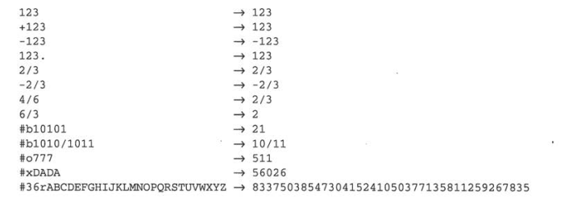
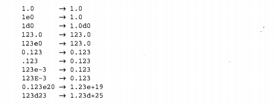
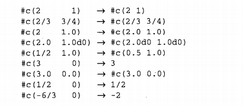
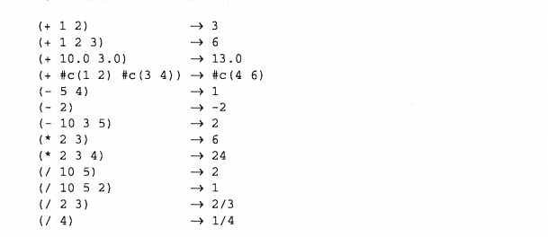

- [第10章-数字、字符和字符串](#sec-1)
  - [字面数值](#sec-1-1)
  - [初等数学](#sec-1-2)
  - [数值比较](#sec-1-3)
  - [字符](#sec-1-4)
  - [字符比较](#sec-1-5)
  - [字符串比较](#sec-1-6)

# 第10章-数字、字符和字符串

## 字面数值

前缀是 `#B` 或 `#b` ，一个字面有理数将以二进制来读取。

前缀是 `#O` 或 `#o` 代表一个八进制数。

前缀是 `#X` 或 `#x` 代表十六进制数。

可以使用前缀 `#nR` 以２到２６的其他禁止书写有理数，其中 `n` 代表进制数，超过9的附加数字从字面 `A-Z` 中获取。

Common Lisp定义了四中浮点子类型：短型(s)、单精度(f)、双精度(d)、长型(l)。字面 `e` 代表默认表示方式(单浮点数)。

Common Lisp复数可以使用前缀 `#C` 或 `#c` 跟上一个由两个实数所组成的列表，分别代表复数的实部和虚部。因为实部和虚部必须同为有理数或相同类型的浮点数，所以共有五种类型的复数。

## 初等数学

基本的算数操作加减乘除，通过函数 `+、-、×、/` 支持所有不同类型的Lisp数字。

当只有一个参数时， `+` 和 `*` 直接返回其值， `-` 返回其相反值，而 `/` 返回其倒数。

如果所有实参都是实数但其中有一个或更多是浮点数，那么其他实参将被转换成实际浮点实参的“最大”浮点表示而成的最接近浮点值。

如果实参中任何一个是复数，则任何实参将会被转换成等价的复数。

因为 `/` 不作截断处理，所以Common Lisp提供了4种类型的截断和舍入用于将一个实数(有理数或浮点数)转换为整数

-   `FLOOR` 向负无穷方向截断，返回小于或等于实参的最大整数。
-   `CEILING` 向正无穷方向截断，返回大于或等于参数的最小整数。
-   `TRUNCATE` 向零截断，对于正实参而言，它等价与 `FLOOR` ，而对于负实参而言，相当于 `CEILING` 。
-   `ROUND` 舍入到最接近的整数上，如果参数刚好位于两个整数之间，它舍入到最接近的偶数上。
-   两个相关的函数是 `MOD` 和 `REM` ，它返回两个实数截断相除得到的模和余数。

函数 `1+` 和 `1-` 提供了表示一个数字增加或减少1的简化方式。它们与宏 `INCF` 和 `DECF` 不同。

-   `1+` 和 `1-` 只是返回一个新值的函数
-   `INCF` 和 `DECF` 会修改一个位置

## 数值比较

函数 `=` 是数值等价谓词，忽略类型上的区别。

通用等价谓词 `EQL` 则需要判断类型是否等价。

函数 `/=` 的全部实参都是不同值才返回真。

`MIN` 和 `MAX` 接受任意数量的数值实参并返回最小或最大的值。

## 字符

任意字符都可以用在 `#\` 之后。

所有实现都支持名字 `Space` 和 `Newline` ，可以做如下替换 `\#Space` 替换 ~#\\ ~

## 字符比较

`CHAR=` 可以接受任意数量的实参并只在它们全是相同字符时才返回真，大小写无关版本是 `CHAR-EQUAL` 。

字符比较函数

| 数值相似物 | 大小写相关 | 大小写无关        |
|----- |------ |----------------- |
| =     | CHAR=  | CHAR-EQUAL        |
| /=    | CHAR/= | CHAR-NOT-EQUAL    |
| <     | CHAR<  | CHAR-LESSP        |
| >     | CHAR>  | CHAR-GREATERP     |
| <=    | CHAR<= | CHAR-NOT-GREATERP |
| >=    | CHAR>= | CHAR-NOT-LESSP    |

## 字符串比较

字符串比较函数

| 数值相似物 | 大小写相关 | 大小写无关          |
|----- |-------- |------------------- |
| =     | STRING=  | STRING-EQUAL        |
| /=    | STRING/= | STRING-NOT-EQUAL    |
| <     | STRING<  | STRING-LESSP        |
| >     | STRING>  | STRING-GREATERP     |
| <=    | STRING<= | STRING-NOT-GREATERP |
| >=    | STRING>= | STRING-NOT-LESSP    |
